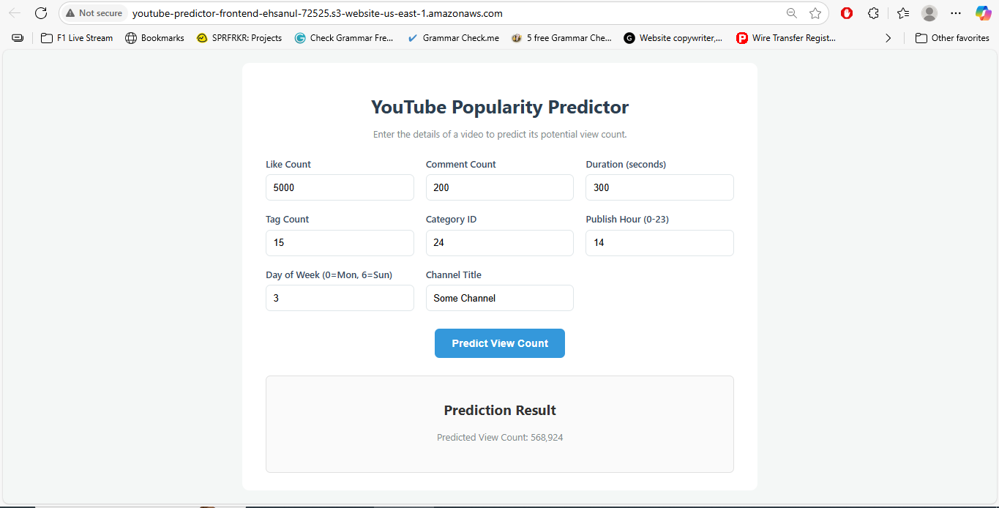

# AWS Serverless YouTube Popularity Predictor


This project is a complete, end-to-end Machine Learning Operations (MLOps) pipeline built on Amazon Web Services (AWS). It trains a model to predict the potential view count of a YouTube video and deploys it as a scalable, cost-effective, serverless API with an interactive web frontend.

The entire architecture is designed to run with **zero ongoing monthly costs**, leveraging the AWS "Always Free" Tier.

**► Live Demo:** [Link to Your Live S3 Website Will Go Here]

## 📸 Application Preview



## 🏆 Key Achievements & MLOps Concepts Demonstrated

This project showcases a full range of modern MLOps skills, from automated cloud-based builds to a fully serverless, user-facing application.

-   **Cost-Effective Architecture:** Engineered the entire prediction service and frontend to operate on the **AWS Always Free Tier** (Lambda, API Gateway, S3), resulting in **$0/month ongoing costs**.
    
-   **CI/CD for Machine Learning:** Implemented a complete CI/CD pipeline using **AWS CodeBuild** and **GitHub**. Pushing code automatically triggers a secure, cloud-based process that builds and pushes a new Lambda-compatible Docker image to **Amazon ECR**.
    
-   **Serverless First:** Deployed the model as a highly-available, auto-scaling serverless function using **AWS Lambda** and **API Gateway**, eliminating the need for idle servers.
    
-   **Static Site Hosting:** Deployed a responsive frontend built with HTML, CSS, and JavaScript as a static website using **AWS S3**, demonstrating a low-cost, high-performance web hosting solution.
    
-   **Containerized Training:** Orchestrated model training as a one-off, containerized batch job on **AWS ECS Fargate**, showcasing the ability to use powerful compute for short-term tasks without incurring continuous costs.
    

## 📊 Model Performance

A baseline Random Forest Regressor was trained on features engineered from video metadata. Evaluated on an unseen test set, the model achieved an **R-squared (R²) of 0.63**, successfully explaining 63% of the variance in video view counts on a challenging, highly skewed real-world dataset.

-   **R-squared (R²):**  0.63
    
-   **Mean Absolute Error (MAE):**  ~5.2 million views
    
-   **Root Mean Squared Error (RMSE):**  ~19.0 million views
    

## 🏛️ Project Architecture

This project follows a professional, industry-standard MLOps workflow:

1.  **Code:** Source code (lambda_function.py, train.py) and configuration (Dockerfile, buildspec.yml) is stored in **GitHub**.
    
2.  **Storage:** The dataset and trained model artifact (.joblib file) are stored in **AWS S3**.
    
3.  **Model Training:** A containerized script is run as a one-off task on **AWS ECS Fargate** to train the model and save the artifact to S3.
    
4.  **CI/CD Pipeline:** A push to GitHub triggers **AWS CodeBuild**, which builds a container image for the Lambda function and pushes it to **Amazon ECR**.
    
5.  **Serverless Inference:**  **AWS Lambda** runs the container from ECR, serving predictions.
    
6.  **API Layer:**  **Amazon API Gateway** provides a public HTTP endpoint that triggers the Lambda function.
    
7.  **Frontend:** A static website (HTML/CSS/JS) is hosted in an **AWS S3** bucket, providing a user interface that calls the API Gateway endpoint.
    

## 🛠️ Tech Stack

-   **Cloud Platform:** AWS (Amazon Web Services)
    
-   **MLOps & CI/CD:** AWS CodeBuild, Docker, GitHub
    
-   **Compute:** AWS Lambda (Serverless), AWS ECS Fargate
    
-   **Storage & Hosting:** AWS S3
    
-   **API:** Amazon API Gateway
    
-   **Machine Learning:** Python, Scikit-learn, Pandas
    
-   **Frontend:** HTML, CSS, JavaScript
    
-   **Infrastructure & Security:** AWS IAM
    
-   **Monitoring:** AWS CloudWatch
    

## 🚀 How to Use the API

The deployed model is available at the following endpoint:

**Endpoint URL:**  https://3bd5z76vu0.execute-api.us-east-1.amazonaws.com/v1/predict

**Method:**  POST

**Body (JSON):**

Generated json

```
{
    "like_count": 5000,
    "comment_count": 200,
    "duration_seconds": 300,
    "tag_count": 15,
    "category_id": 24,
    "publish_hour": 14,
    "publish_day_of_week": 3,
    "channel_title": "Some Channel"
}
```

## ⚙️ Setting Up and Running the Project

This is an advanced MLOps project that requires a configured AWS environment. While a simple local run is not possible due to the cloud-native architecture, here are the high-level steps to replicate the deployment:

### Prerequisites
*   An AWS Account with appropriate IAM permissions.
*   AWS CLI configured locally.
*   Docker installed locally.
*   A GitHub account.

### Setup and Deployment Steps

1.  **Clone the Repository:**
    ```bash
    git clone https://github.com/MdEhsanulHaqueKanan/aws-serverless-youtube-predictor.git
    cd aws-serverless-youtube-predictor
    ```

2.  **AWS Infrastructure Setup:**
    *   **Create S3 Bucket:** Manually create an S3 bucket to store the dataset and the trained model artifact.
    *   **Create ECR Repositories:** Manually create two private ECR repositories: one for the training image (e.g., `youtube-popularity-trainer`) and one for the inference image (`youtube-popularity-predictor`).

3.  **Run the Training Job:**
    *   The model can be trained by building the `Dockerfile.train` and running it as a one-off task on **AWS ECS Fargate**. This task reads the data from S3, trains the model, and saves the `youtube_popularity_model.joblib` artifact back to S3.

4.  **Set Up the CI/CD Pipeline:**
    *   Create an **AWS CodeBuild** project, connecting it to your forked GitHub repository.
    *   Configure the project's service role with permissions to push images to ECR.
    *   The `buildspec.yml` in this repository will automatically be used by CodeBuild.

5.  **Build the Lambda Image:**
    *   Trigger a build in CodeBuild. This will use the `Dockerfile.lambda` to build a Lambda-compatible container image and push it to your ECR repository.

6.  **Deploy the Serverless API:**
    *   Create an **AWS Lambda function** from the container image in ECR.
    *   Configure the Lambda's IAM role with permissions to read the model artifact from S3.
    *   Create an **Amazon API Gateway** (REST API) with a `/predict` resource and a `POST` method.
    *   Integrate the `POST` method with your Lambda function using Lambda Proxy Integration.
    *   Manually add and configure an `OPTIONS` method on the `/predict` resource to enable CORS.
    *   Deploy the API to a stage (e.g., `v1`).

7.  **Run the Frontend:**
    *   Update the `API_ENDPOINT` variable in the `frontend/script.js` file with your new API Gateway Invoke URL.
    *   Open the `frontend/index.html` file in a local browser to interact with the deployed API.

    ___

    Developed by Md. Ehsanul Haque Kanan